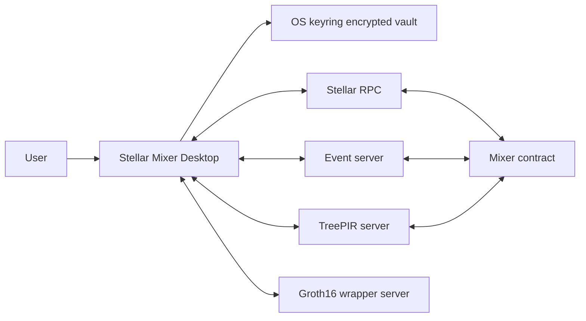
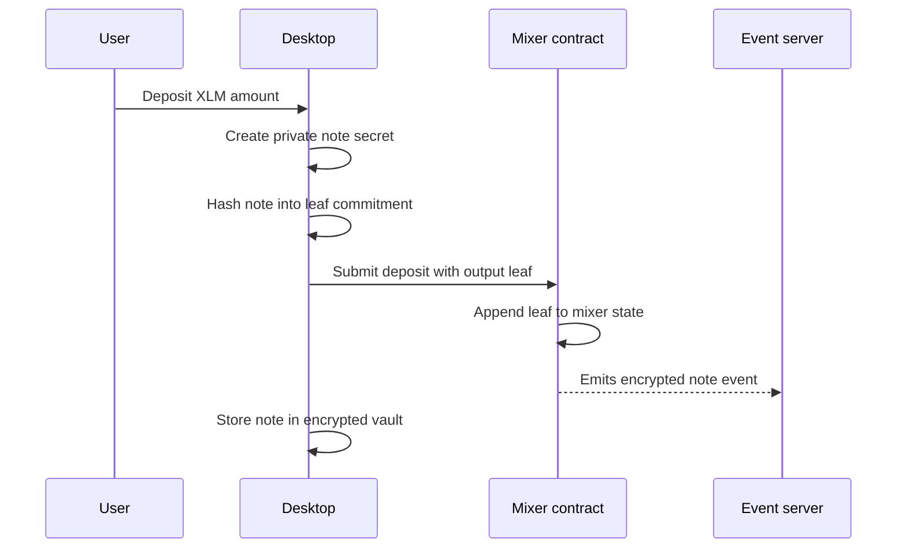
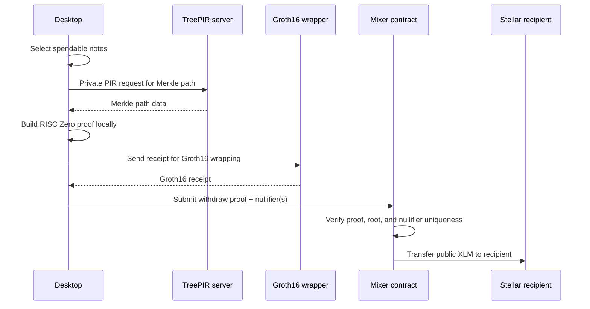
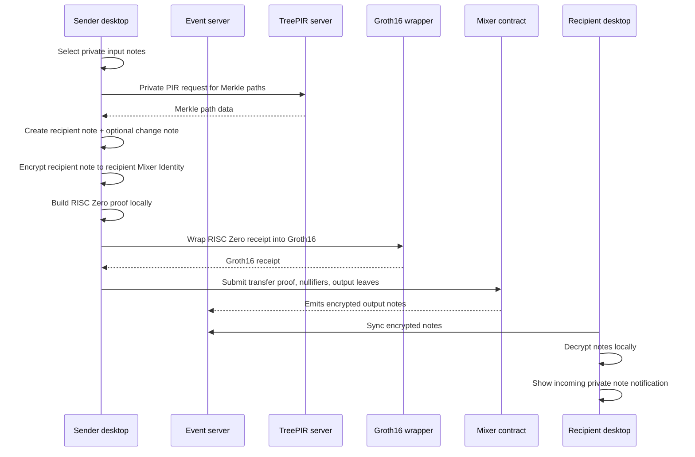

# Stellar Mixer Desktop

<p align="center">
  <strong>Private Stellar testnet mixer desktop app powered by Tauri, RISC Zero, TreePIR, and Soroban.</strong>
</p>

<p align="center">
  <a href="https://tauri.app/"></a>
  <a href="https://react.dev/"></a>
  <a href="https://www.rust-lang.org/"></a>
  <a href="https://stellar.org/"></a>
  <a href="https://www.risczero.com/"></a>
</p>

---

## What this is

**Stellar Mixer Desktop** is a local desktop client for a private Stellar mixer.

It provides a complete user flow for:

- creating and unlocking a local **Mixer Identity**;
- managing Stellar accounts used for deposits, withdrawals, transfers, and fees;
- creating private notes;
- proving deposits, withdrawals, and transfers;
- syncing encrypted note events from the archive;
- requesting Merkle paths privately through TreePIR;
- wrapping RISC Zero receipts into Groth16 receipts;
- submitting verified operations to a minimal Soroban mixer contract.

> Private keys, note secrets, nullifiers, and raw vault contents stay local.

---

## System overview



The mixer is intentionally split into small parts:

| Component | Purpose |
|---|---|
| **Desktop app** | Local UI, encrypted vault, proof orchestration, Stellar transaction submission. |
| **Mixer contract** | Minimal on-chain state: commitments, nullifiers, root history, proof verification. |
| **TreePIR server** | Serves Merkle path data without learning which path the client needs. |
| **Event server** | Indexes encrypted note events and nullifiers for sync and recovery. It cannot decrypt user notes. |
| **Groth16 wrapper server** | Converts a local RISC Zero receipt into a Groth16 receipt accepted by the Stellar verifier stack. |
| **RISC0 prover guests** | Reproducible guest programs that define the private proof logic. |

---

## Current testnet configuration

These values are configured in `src-tauri/src/config.rs`.

| Name | Value |
|---|---|
| Stellar RPC | `https://soroban-rpc.testnet.stellar.gateway.fm` |
| Mixer contract | `CCO2BNPJQENNYXHYE5JWGNX74SNHZT74V3OL2IFCJOVZHEJVO2KVWEN5` |
| TreePIR server | `http://213.171.26.211:3000` |
| Event server | `http://213.171.26.211:3001` |
| Groth16 wrapper | `http://213.171.26.211:8080/wrap` |
| Merkle depth | `45` |

RISC Zero guest binaries are stored inside the Tauri project:

```text
src-tauri/guests/transfer_guest.bin
src-tauri/guests/withdraw_guest.bin
```

The image IDs in `src-tauri/src/config.rs` must match the image IDs configured in the deployed mixer contract.

---

## How the mixer works

The mixer turns public Stellar token movement into private note ownership.

```text
public XLM/account activity
        ↓
private mixer notes
        ↓
zero-knowledge spend proof
        ↓
public withdrawal or private transfer output
```

### 1. Deposit



A deposit creates a new private note. The chain sees a commitment leaf, not the local note secret.

The desktop stores the full note in the encrypted vault after the transaction succeeds.

---

### 2. Withdraw



A withdraw proves that:

- the input note exists in a known Merkle root;
- the user knows the note secret;
- the nullifier is derived correctly;
- the note was not already spent;
- the public output amount is valid.

The contract sees nullifiers and proof data, but not the private note secret.

---

### 3. Transfer



A private transfer consumes sender notes and creates new output notes:

- one note for the recipient;
- optionally one change note back to the sender.

The recipient learns about the transfer by syncing encrypted events from the event server. The event server only stores ciphertext. Only the recipient Mixer Identity can decrypt the recipient note.

---

## What is a note?

A **note** is the private unit of ownership inside the mixer.

Unlike fixed-denomination mixers, Stellar Mixer notes are **not limited to fixed sizes**. A note can represent any supported XLM amount. That means deposits, withdrawals, and transfers are flexible: the user is not forced into predefined buckets such as `1`, `10`, or `100`.

Conceptually, a note contains private data:

```text
amount
owner identity / recipient identity material
random secret
nullifier secret
metadata needed to spend or recover the note
```

Each note has an **owner**. In practical terms, that means only the holder of the correct Mixer Identity private key material can actually use that note as a valid input later.

When a note is spent, the desktop proves ownership privately. It builds a RISC Zero proof locally and then wraps it into a Groth16 proof for the on-chain verifier. A valid proof can only be produced by someone who knows the correct private note data and the correct owner-side secret material.

The desktop turns this private note data into a public commitment:

```text
private note data
        ↓ cryptographic hash
leaf commitment
        ↓ append
Mixer Merkle tree
```

Only the commitment is stored on-chain. The full note stays inside the user's encrypted local vault.

When a note is spent, the zero-knowledge proof shows:

```text
I know a valid private note
AND I control the owner-side secret material for that note
AND its commitment exists in the Merkle tree
AND the derived nullifier has not been used before
AND the value accounting is correct
AND the requested withdraw/transfer outputs are valid
```

without revealing which historical note is being spent.

Flexible amounts are handled by creating new output notes:

```text
withdraw:
  input note(s) → public recipient amount
                + optional private change note

transfer:
  input note(s) → recipient private note
                + optional sender change note
```

So the mixer does not need fixed buckets. It can support arbitrary user-selected amounts while preserving private ownership through commitments, Merkle roots, nullifiers, and zero-knowledge proofs.

---

## Minimal mixer contract

The Soroban mixer contract is intentionally minimal.

It does not store user accounts, plaintext notes, encrypted note contents, or local wallet state.

It only needs to track:

- Merkle roots / root history;
- output leaf commitments;
- spent nullifiers;
- verifier configuration;
- token movement rules.

That means most heavy logic remains outside the contract:

```text
Desktop app:
  note construction
  encryption/decryption
  proof generation
  coin selection
  vault state
  archive sync

Infrastructure:
  Merkle path retrieval
  encrypted event indexing
  Groth16 wrapping

Contract:
  verify proof
  check nullifier uniqueness
  update commitment/nullifier state
  move tokens
```

---

## Privacy model

The app is designed so that infrastructure servers help with availability and performance without receiving raw secrets.

### TreePIR server

The TreePIR server serves Merkle path data. The client uses private information retrieval so the server should not learn which leaf or sibling indexes are being requested.

The server helps the client build a Merkle proof, but it should not learn:

- selected note leaf index;
- selected sibling indexes;
- which path belongs to the user;
- which note is being spent.

### Event server

The event server indexes:

- encrypted note events;
- nullifiers;
- archive cursors.

It cannot decrypt note payloads. The desktop downloads encrypted note batches and tries to decrypt them locally.

### Groth16 wrapper

The Groth16 wrapper receives proof/receipt data and returns a wrapped Groth16 receipt.

It does not receive:

- Stellar secret keys;
- vault password;
- raw vault data;
- plaintext note payloads;
- decrypted archive contents.

Normal network metadata, such as IP address, timing, and request size, can still exist at the transport layer. For stronger network-level privacy, run through a privacy network, VPN, or self-hosted infrastructure.

---

## Local storage and security

### Secret storage

Stellar Mixer Desktop uses the operating system keyring as its secret storage layer.

On macOS this is the native **Keychain**. On other platforms this maps to the platform keyring or credential store supported by the operating system integration layer. These systems are designed specifically for protecting application secrets and are significantly safer than ordinary application files, frontend storage, or plain local databases.

The mixer vault is encrypted before it is stored. The user's vault password is used to derive a strong encryption key, and that derived key is used to decrypt the local mixer vault only after unlock.

The stored payload is therefore not raw plaintext secret material:

```text
vault password
    ↓ secure key derivation
vault encryption key
    ↓ decrypt locally after unlock
Mixer vault in local Rust memory
```

The protected vault contains:

- Mixer Identity private material;
- Stellar account secret keys;
- private notes;
- note secrets and nullifier material;
- archive cursors;
- recovery-related state.

This gives two layers of local protection:

```text
operating system keyring protection
    +
password-derived mixer vault encryption
```

A passive attacker who only obtains app files or UI-state files should not get usable secret values. Offline brute force is made difficult because the vault password is not used directly as an encryption key; it is passed through a dedicated key-derivation step first.

After unlock, decrypted values live inside the local Rust backend process memory while the app is running. They are not stored in the React frontend state or ordinary browser-style UI storage.

---

## Recovery and backup

The app supports two recovery paths.

| Recovery method | What it restores |
|---|---|
| **Recovery phrase** | Restores the Mixer Identity and rescans the event archive for decryptable notes. |
| **Full encrypted backup** | Restores vault data, accounts, notes, cursors, roles, and UI history. |

The recovery phrase is useful when moving identity to a new installation.

The full backup is useful when preserving the complete local app state.

---

## Features

### Deposit

Creates a new private note from public XLM.

```text
public XLM → private mixer note
```

### Withdraw

Spends private notes and sends public XLM to a Stellar address.

```text
private mixer note(s) → public Stellar address
```

If the selected account does not have enough public XLM for Stellar fees, the app can ask another eligible account to act as fee payer.

### Transfer

Transfers private value to another Mixer Identity.

```text
sender private note(s) → recipient private note
                       + optional sender change note
```

Only the recipient Mixer Identity can decrypt the received note.

---

## Project structure

```text
stellar-mixer-desktop
├── src
│   ├── components              # React UI components
│   ├── lib
│   │   ├── db.ts               # Local UI state
│   │   ├── stellarPublic.ts    # Public Stellar balance reads
│   │   ├── tauri.ts            # Frontend → Rust invoke bridge
│   │   └── types.ts            # Shared frontend types
│   ├── styles/app.css
│   ├── App.tsx
│   └── main.tsx
│
├── src-tauri
│   ├── guests                  # RISC Zero guest binaries
│   ├── src
│   │   ├── mixer               # Archive sync, flow orchestration, coin selection
│   │   ├── proofs              # Note encoding, transfer/withdraw proof helpers
│   │   ├── security            # Vault, crypto, identity, local secret handling
│   │   ├── stellar             # Stellar accounts and contract calls
│   │   ├── commands.rs         # Tauri command handlers
│   │   ├── config.rs           # Network, contract, server, guest constants
│   │   ├── models.rs           # Backend data models
│   │   └── state.rs            # Runtime app state
│   ├── Cargo.toml
│   └── tauri.conf.json
│
├── package.json
├── vite.config.ts
└── README.md
```

---

## Prerequisites

### Required for all platforms

Install:

- Rust via `rustup`;
- Node.js LTS;
- npm;
- platform-specific Tauri dependencies.

Check versions:

```bash
rustc --version
cargo --version
node --version
npm --version
```

Official Tauri prerequisites: [https://v2.tauri.app/start/prerequisites/](https://v2.tauri.app/start/prerequisites/)

### macOS

Install Xcode Command Line Tools:

```bash
xcode-select --install
```

Full Xcode is only needed for iOS/mobile development or advanced Apple signing workflows.

### Linux

Install WebKitGTK and native build packages for your distribution.

Debian/Ubuntu example:

```bash
sudo apt update
sudo apt install -y \
  libwebkit2gtk-4.1-dev \
  build-essential \
  curl \
  wget \
  file \
  libxdo-dev \
  libssl-dev \
  libayatana-appindicator3-dev \
  librsvg2-dev
```

### Windows

Install:

- Microsoft C++ Build Tools with **Desktop development with C++**;
- Microsoft Edge WebView2 Runtime if it is not already installed;
- Rust MSVC toolchain.

---

## Install dependencies

```bash
git clone https://github.com/stellar-mixer/stellar-mixer-desktop.git
cd stellar-mixer-desktop

npm install
```

---

## Run in development mode

Default dev mode:

```bash
npm run tauri -- dev
```

If the project script is available:

```bash
npm run tauri:dev
```

Release-optimized dev mode:

```bash
npm run tauri -- dev --release
```

This is slower to compile, but closer to production runtime performance.

---


## Build the full desktop app

```bash
npm run tauri -- build
```

Build artifacts are written under:

```text
src-tauri/target/release/bundle/
```

On macOS, common outputs are:

```text
src-tauri/target/release/bundle/macos/Stellar Mixer.app
src-tauri/target/release/bundle/dmg/*.dmg
```

Open the built macOS app locally:

```bash
open "src-tauri/target/release/bundle/macos/Stellar Mixer.app"
```

---


## Useful development commands

```bash
# Install JS dependencies
npm install

# Run frontend only
npm run dev

# Run Tauri dev
npm run tauri -- dev

# Run Tauri dev in release mode
npm run tauri -- dev --release

# Build frontend
npm run build

# Check Rust
cd src-tauri && cargo check

# Build bundled desktop app
npm run tauri -- build
```

---

## Important privacy notes

This is a testnet desktop client.

The protocol is designed so that:

- Stellar secret keys stay local;
- note secrets stay local;
- raw vault data stays local;
- event server data is encrypted;
- Merkle path lookup uses TreePIR;
- proof generation happens locally;
- the contract verifies proofs without learning private note contents.

However, normal network metadata such as IP address, timing, and request size can still exist at the transport layer unless the user runs through additional network privacy tooling.

---

## Related repositories

| Repository | Purpose |
|---|---|
| [`stellar-mixer-contract`](https://github.com/stellar-mixer/stellar-mixer-contract) | Minimal Soroban mixer contract. |
| [`stellar-mixer-risc0-prover`](https://github.com/stellar-mixer/stellar-mixer-risc0-prover) | Reproducible RISC Zero guest programs and image IDs. |
| [`treepir-core`](https://github.com/stellar-mixer/treepir-core) | Generic TreePIR Rust core library. |
| [`treepir-client`](https://github.com/stellar-mixer/treepir-client) | Generic TreePIR HTTP client. |
| [`stellar-mixer-treepir-server`](https://github.com/stellar-mixer/stellar-mixer-treepir-server) | Mixer-specific TreePIR Merkle path server. |
| [`stellar-mixer-event-server`](https://github.com/stellar-mixer/stellar-mixer-event-server) | Encrypted note and nullifier archive server. |
| [`risc0-groth16-wrapper-server`](https://github.com/stellar-mixer/risc0-groth16-wrapper-server) | STARK-to-Groth16 wrapping service. |

---

## Status

This project is currently a testnet implementation.

Use it for development, research, and controlled testing. Do not treat it as audited production privacy infrastructure.
